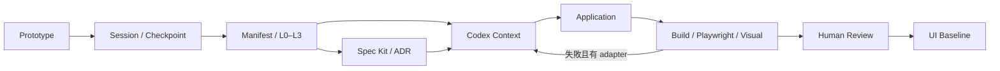

# ProtoFlow

ProtoFlow 是可透過 Codex Skill 接入的原型驅動工程引擎。共享 Node.js 引擎持有流程、協定與驗證；目標專案安裝輕量 Skill、配置及 AGENTS 約定，保留自己的原型、實作和回歸測試。

**v0.1 可執行：**原型目錄監聽、Design Session／checkpoint、Git diff／Change Manifest、L0–L3 路由、Spec Kit／BMad 邊界、Codex 執行接口、瀏覽器視覺驗證、有限修復迴圈、人工 Review 與 UI Baseline。初版採本機 JSON 證據，沒有雲端服務或畫布 UI。



## 安裝共享引擎

需要 Node.js 22+、npm、Git，以及 Playwright Chromium。初版尚未發布到 npm；使用 checkout 或本機打包檔安裝。

```sh
git clone https://github.com/zhangqiu-ai/protoflow.git
cd protoflow
npm ci
npx playwright install chromium
npm run validate
# 選用：將這份共享引擎的 CLI 加到 PATH
npm link
```

也可直接使用 `node /absolute/path/protoflow/bin/protoflow.js`，不需全域安裝。所有以下命令的 `protoflow` 都可替換為此形式。

```sh
protoflow init --project /path/to/app
protoflow install --project /path/to/app
```

目標專案新增 `protoflow.config.json`、`.agents/skills/protoflow/` 和 AGENTS managed block，**不複製引擎**。既有配置、既有 Skill 及使用者 AGENTS 內容保留；重複執行會列出 skipped。個人 Skill 安裝：

```sh
protoflow install --personal --project /path/to/app
```

依此使用者環境的安裝政策，來源為 `/Users/feature/GitHub/skills/protoflow`，Codex discovery 是 `/Users/feature/.codex/skills/protoflow` 的個別 symlink。其他機器可使用 `--source-dir` 和 `--discovery-dir`。細節見 [Skill 安裝](docs/skill-installation.md)。

## 接入配置

`init` 產生保守預設：沒有臆測的元件映射、沒有外部 adapter、沒有驗證命令。填入真實配置後開始流程。參考 [完整模板](templates/protoflow.config.json)、[可執行 Demo](examples/demo/protoflow.config.json) 與 [配置協定](schemas/config.schema.json)。

```json
{
  "schemaVersion": 1,
  "prototypeDir": "prototype",
  "mappings": [{
    "id": "chat-input",
    "prototypeFiles": ["prototype/chat.html", "prototype/chat.css"],
    "prototype": "#chat-input",
    "application": "[data-ui='chat-input']",
    "component": "src/ChatInput.tsx",
    "priority": "critical"
  }],
  "classification": {"rules": [{"pattern": "prototype/auth/**", "level": "L3"}]},
  "policy": {"maxRepairAttempts": 3, "requireHumanReview": true},
  "verification": {
    "build": {"argv": ["npm", "run", "build"]},
    "functional": {"argv": ["npx", "playwright", "test"]}
  },
  "visual": {
    "maxDiffRatio": 0.01,
    "geometryTolerance": 1,
    "scenes": [{
      "id": "chat.default",
      "prototypeUrl": "http://127.0.0.1:3001/chat.html",
      "applicationUrl": "http://127.0.0.1:3000/chat",
      "viewport": {"width": 1440, "height": 900},
      "mappings": ["chat-input"]
    }]
  }
}
```

`prototypeFiles` 是專案相對路徑 glob，支援 `*`、`**`、`?`。`prototype`／`application` 是各自頁面的 CSS selector；`component` 是實作檔案路徑。每個映射 selector 必須唯一且可見。配置以 schema 驗證，拒絕未知欄位、無效門檻和專案外檔案路徑。

將 `.protoflow/` 加入目標專案的 `.gitignore`，或明確選擇 evidence 版本化方式；`init` 會保留既有忽略策略。

## 核心命令

| 命令 | 作用 |
|---|---|
| `init` / `install` | 建立配置與約定／安裝 Skill |
| `session start` / `session list` | 設計會話及修改前快照 |
| `watch [--once]` | 檔案輪詢、idle debounce、checkpoint |
| `checkpoint [--session ID]` | 精確 before/after Manifest |
| `prepare --adapter specKit\|bmad --manifest ID` | 執行明確配置的規格／架構 adapter |
| `context --manifest ID [--spec PATH] [--adr PATH]` | 建立有映射與政策閘門的 Context Package |
| `execute --context ID [--execute]` | 乾跑 request 或實際 Codex adapter |
| `verify --manifest ID` | build、functional、視覺與證據 hash |
| `repair --manifest ID [--execute]` | 驗證→修復→再驗證，最多配置次數 |
| `review create --manifest ID --verification ID` | 建立待人工判斷資料 |
| `review approve\|reject\|request-changes --review ID --reviewer NAME` | 記錄人工決定 |
| `baseline create --review ID` / `baseline show` | 保存批准節點／讀取最新節點 |
| `status` | 會話及最新 Baseline |

各命令接受 `--project PATH`。輸出 JSON；`watch` 先輸出 `ready`，每個穩定修改批次輸出 `checkpoint`。退出碼：`0` 成功，`1` 錯誤／驗證失敗，`2` 未執行／仍需 Review。不自動 Git add、commit、push 或部署。

### 修改與批准

```sh
protoflow session start --project /path/to/app --label "Adjust chat input"
# 編輯 prototype；使用回傳的 session ID
protoflow checkpoint --project /path/to/app --session SESSION_ID
protoflow context --project /path/to/app --manifest MANIFEST_ID
protoflow execute --project /path/to/app --context CONTEXT_ID
# 確認 request 與授權後，加入 --execute 執行已配置的 adapter
protoflow verify --project /path/to/app --manifest MANIFEST_ID
protoflow review create --project /path/to/app --manifest MANIFEST_ID --verification VERIFICATION_ID
# 真實人類看過視覺報告並明確批准後：
protoflow review approve --project /path/to/app --review REVIEW_ID --reviewer HUMAN_NAME
protoflow baseline create --project /path/to/app --review REVIEW_ID
```

`watch` 持有專案寫入鎖；需要別的變更命令時先以 Ctrl+C 停止。中斷的 active session 可在下次 watch 恢復。鎖會在正常退出釋放；若程序意外退出，先核對 `.protoflow/active.lock/owner.json` 的 owner 是否仍活躍，再人工恢復，不能因鎖看起來舊就刪除。

初次 checkpoint 包含現有未追蹤原型。新增或未知 JavaScript 通常屬 L2，需 `--spec`；`--level` 與規則只能提高等級。L3 額外需要綁定 `manifestHash`、`status: approved` 和真實 reviewer 的 ADR JSON。詳細範例見 [協定與狀態](docs/protocols.md)。

## Demo

Demo 的 prototype 與 app 是獨立 HTML，包含建立 Design Session 的互動。Demo 命令應從 repository 根目錄執行：

```sh
node bin/protoflow.js init --project examples/demo
node bin/protoflow.js install --project examples/demo
node bin/protoflow.js checkpoint --project examples/demo
# 使用 checkpoint 回傳的 ID；提供已備妥的 Demo specification
node bin/protoflow.js context --project examples/demo --manifest MANIFEST_ID --spec specs/demo.md
npm run demo
```

在第二個 terminal：

```sh
node bin/protoflow.js verify --project examples/demo --manifest MANIFEST_ID
```

驗證會生成 `.protoflow/artifacts/VER_ID/visual-review.html`、prototype/app 截圖、side-by-side、overlay、diff，以及逐元件幾何／樣式／像素結果。Demo 的 functional 命令使用此 checkout 的 Playwright runner；搬到其他專案時改成該專案自己的命令。Demo 試跑只建立 pending Review，不代替真實產品批准。

## 外部工具與驗證界線

Spec Kit／BMad 保持獨立工具；ProtoFlow 產生 request，接受 adapter 回傳的實際 artifact，**不把 agent skill 當 terminal 命令**。接口已用本機測試 adapter 驗證；初版不自動安裝或執行這些外部框架。官方來源：[Spec Kit](https://github.com/github/spec-kit)、[BMad](https://github.com/bmad-code-org/BMAD-METHOD)。

Codex 橋接在 `scripts/codex-adapter.js`：配置 `argv: ["node", "/absolute/shared-engine/scripts/codex-adapter.js"]`。它將 Context Package 經 stdin 交給 `codex exec --json --sandbox workspace-write -`；需要已安裝且可使用的 Codex。命令參數已對照本機 CLI help 和 [官方非互動模式](https://developers.openai.com/codex/noninteractive)。Adapter 退出成功只表示程序完成，最終是否可批准仍由 `verify` 決定。

視覺驗證固定 viewport、DPR、locale、theme、timezone、fixture、互動步驟與遮罩；比較 geometry、computed styles、全視窗與每個元件區域。任何映射失敗、未映射變更、缺失覆蓋都不能靠整頁平均值通過。原生 UI、動畫時序、真正裝置和後端 provider 驗收需另接專案測試；native 模式記錄 `NOT_RUN`。詳見 [架構](docs/architecture.md) 與 [整合協定](docs/integrations.md)。

## 驗證與擴充

```sh
npm run check       # JavaScript syntax + 配置 schema
npm test            # 安裝、分類、watch、協定、政策及過期證據
npm run test:e2e    # Node.js Playwright runner：互動、視覺、CLI完整流程、修復迴圈
npm run validate   # 全部
npm pack           # 可移交的本機 npm package；不會 publish
```

測試隔離在暫存專案；人工批准測試使用明確的 synthetic reviewer，沒有批准真實專案。CI 保存相同 runner 流程。Node API 從 `src/index.js` 匯出；CLI 是薄入口，adapter 使用版本化 JSON。下一步是在真實目標專案填入映射、固定測試資料、配置 build／Playwright 與 Codex adapter，再由人類驗收第一個 Baseline。
